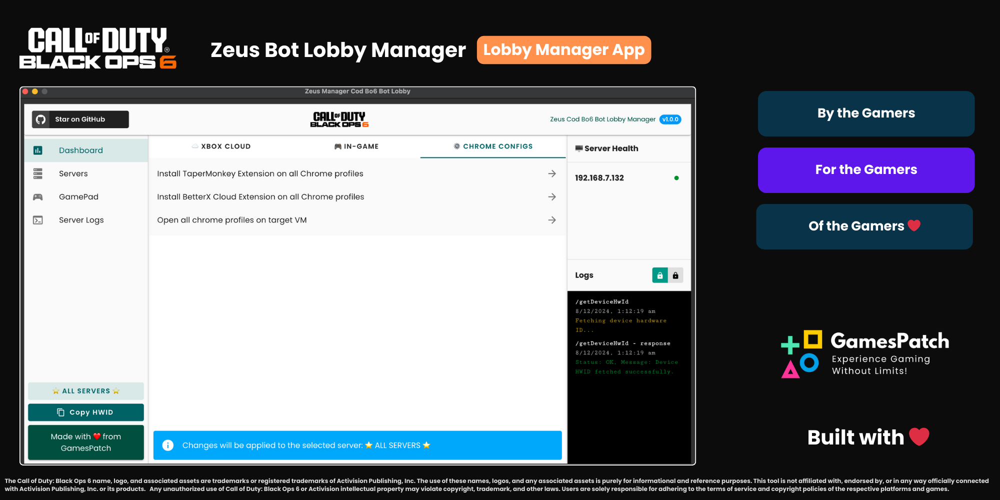

# Zeus COD BO6 Bot Manager
If you are looking for the Server app/script: [Zeus Server App Github](https://github.com/satyajiit/zeus-server-load)


> **Platform:** Cross-platform (Windows, macOS, Linux)





## Overview

The **Zeus COD BO6 Bot Manager** is a powerful tool for managing bot lobbies in multiplayer games like Call of Duty Black Ops 6. It supports dashboard functionalities, remote server health checks, and in-game anti-AFK mechanisms. The tool is designed for convenience and efficiency, with a UI powered by Vue3 and Vuetify.

## Features

- **Cross-platform Compatibility:** Runs on Windows, macOS, and Linux.
- **Dashboard:** Monitor connected servers and health checks.
- **One-Click Automation:**
  - Launch multiple Chrome profiles simultaneously.
  - Install TamperMonkey and Better X Cloud scripts.
  - Enable Xbox Cloud anti-AFK mechanisms.
- **In-Game Controls:** Use the manager to control basic gamepad functions (D-pad, X, Y, A, B, L, R).
- **Integration:** Works seamlessly with the Zeus Server App.
- **User-Friendly UI:** Intuitive interface for easy navigation and control.
- **Logging:** Detailed logs for tracking server activities and bot lobbies.

## Installation

1. Ensure Python is installed on your system ([Download Python](https://www.python.org/downloads/)).
2. Install the Zeus COD BO6 Bot Manager using pip:
   ```bash
   pip install zeus-cod-bo6-bot-manager
   ```
3. Run the app:
   ```bash
   python3 -m zeus_cod_bo6_bot_manager
   ```

## Dependencies

The following Python packages are required:
- `flask-cors`
- `Flask`
- `PySide6`
- `PyQtWebEngine`
- `pyperclip`

The UI uses Vue3 and Vuetify. During the first run, the tool intelligently checks for Node.js and installs it if necessary.

## Setup Guide

1. Launch the app and connect to the Zeus Server App.
2. Use the dashboard to:
   - Monitor server health.
   - Launch Chrome profiles and TamperMonkey scripts.
   - Configure anti-AFK settings.
3. Start matchmaking and manage bot lobbies with ease.


## Contributing


We welcome contributions to improve the Zeus COD BO6 Bot Manager! Please follow these steps:

1. Fork the repository.
2. Create a new branch:
   ```bash
   git checkout -b feature-name
   ```
3. Commit your changes:
   ```bash
   git commit -m "Added a new feature"
   ```
4. Push your branch:
   ```bash
   git push origin feature-name
   ```
5. Submit a pull request.

## Tech


## License


This project is licensed under the MIT License. See the `LICENSE` file for details.

## Credits

This project is inspired by [BotOps Hub Bot Lobby Tool](https://www.unknowncheats.me/forum/call-of-duty-black-ops-6-a/674129-botops-hub-bot-lobby-tool-vm-required.html). Special thanks to the original contributors for their ideas.

---

## Star This Project ⭐

If you find this tool helpful, please star the repositories to show your support!

## Disclaimer

This tool, **Cod Bo6 Bot Lobby Manager**, is intended for **educational and testing purposes only**. The developers of this tool do not endorse or encourage any form of unethical gameplay, account manipulation, or violation of terms of service of any game or gaming platform. 

By using this tool, you agree to the following:
- You will use this tool in accordance with all applicable laws and regulations.
- You will not use this tool to gain unfair advantages or disrupt the integrity of multiplayer gaming environments.
- The developers are not responsible for any consequences, including but not limited to account suspension, bans, or other punitive measures, resulting from improper usage of this tool.

This software is provided "as is" without warranty of any kind, express or implied. Use at your own risk.

## Copyright Notice

The **Call of Duty: Black Ops 6** name, logo, and associated assets are trademarks or registered trademarks of **Activision Publishing, Inc.** The use of these names, logos, and any associated assets is purely for informational and reference purposes. This tool is not affiliated with, endorsed by, or in any way officially connected with **Activision Publishing, Inc.** or its products.

Any unauthorized use of **Call of Duty: Black Ops 6** or **Activision** intellectual property may violate copyright, trademark, and other laws. Users are solely responsible for adhering to the terms of service and copyright policies of the respective platforms and games. 

If you have any concerns or questions about the use of **Call of Duty: Black Ops 6** or **Activision** assets in this tool, please contact us for clarification.

Email: **hello.theappstack@gmail.com** , any violating content would be removed immediately.

---
